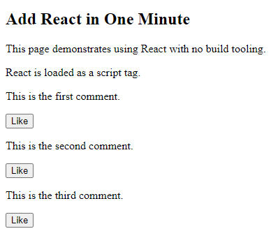

```html
<p>
  This is the first comment.
  <!-- We will put our React component inside this div. -->
  <div class="like_button_container" data-commentid="1"></div>
</p>

<p>
  This is the second comment.
  <!-- We will put our React component inside this div. -->
  <div class="like_button_container" data-commentid="2"></div>
</p>

<p>
  This is the third comment.
  <!-- We will put our React component inside this div. -->
  <div class="like_button_container" data-commentid="3"></div>
</p>
```

```jsx
// Find all DOM containers, and render Like buttons into them.
document.querySelectorAll('.like_button_container')
  .forEach(domContainer => {
    // Read the comment ID from a data-* attribute.
    const commentID = parseInt(domContainer.dataset.commentid, 10);
    const root = ReactDOM.createRoot(domContainer);
    root.render(
      e(LikeButton, { commentID: commentID })
    );
  });
```

